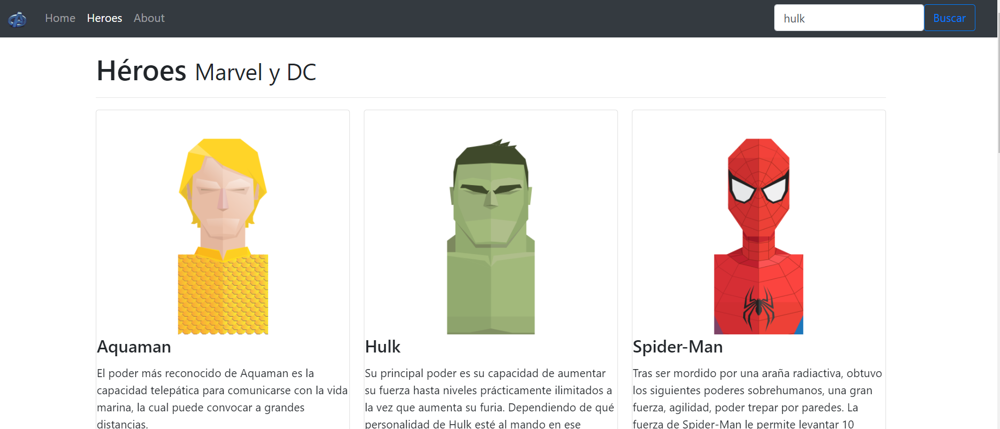

# Hero App

---

### Description
A Hero app, master-detail style app with search and navigation. Was made while learning Angular following this great course from Fernando Herrera.

[Udemy - Fernando Herrera - Angular: De cero a experto.](https://www.udemy.com/share/101Wds3@S0opZ16xnJWAL-7hIXfK4Y1e_EOreKyocpG8FYixECNXl13CqSRfa3r39VgOdi_7Hg==/)

---

## Use

To run the angular application you need to run npm install to get the needed packages and ng serve -o to run it in a local server.

---

## Technologies

- Angular
- Type Script
- Bootstrap

---
## Author Info

- Linkedin - [Federico Andrés Jácome Castañeda](https://www.linkedin.com/in/federicojacome/)
- Website - [Portfolio](https://federocky.github.io/PersonalWeb/)

[Back To The Top](#read-me-template)
